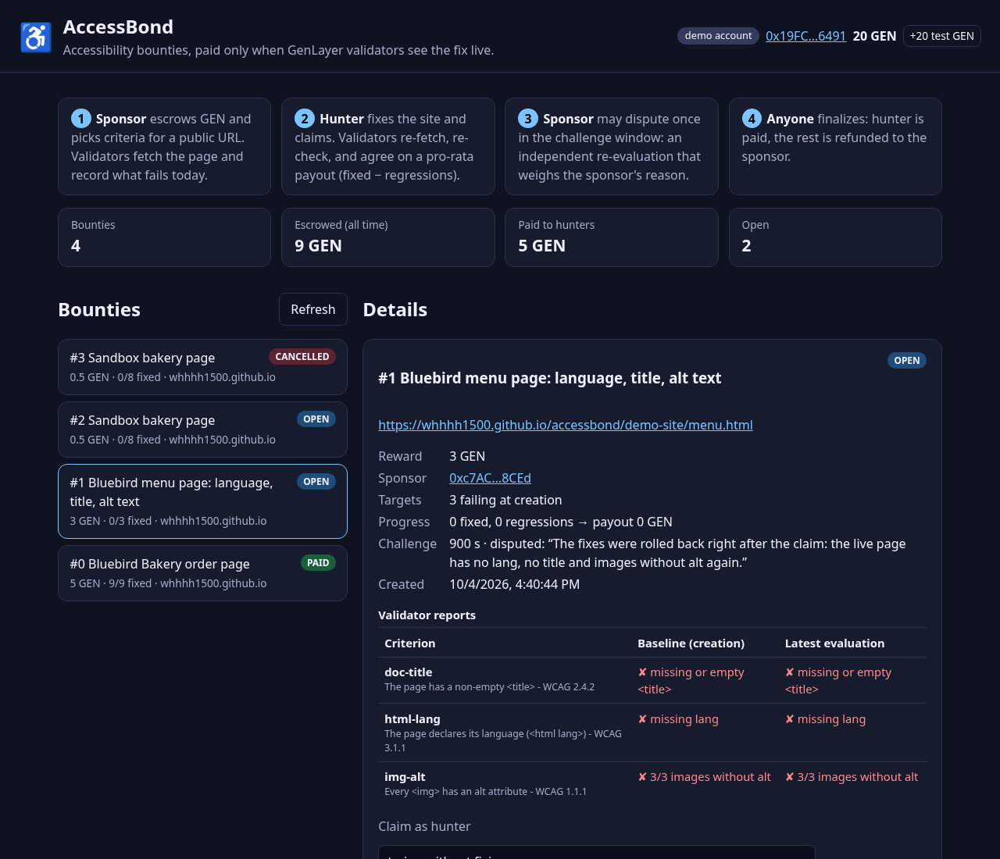
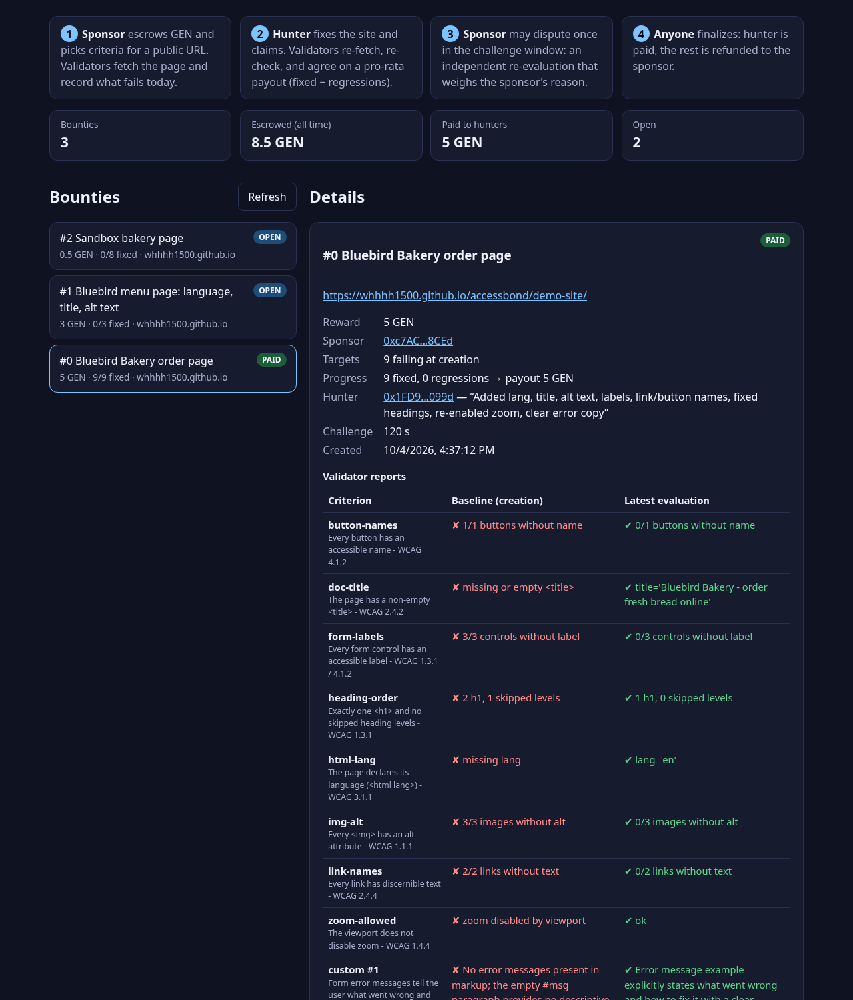

# AccessBond

**Accessibility bounties that pay out only when GenLayer validators see the fix on the live site.**

A sponsor escrows GEN against "make this public page meet these accessibility criteria".
GenLayer validators fetch the page, record what fails today, and later independently
re-check the live site when a hunter claims the fix. They then agree on a pro-rata payout.
The sponsor gets one dispute (appeal) during a challenge window. Nobody has to trust
the sponsor, the hunter, or a single auditor.

- **Live app:** https://whhhh1500.github.io/accessbond/ (GenLayer Studio. Click *Use demo account* to get a funded burner wallet, or connect a browser wallet.)
- **Contract (studionet):** [`0x86573EFCC588d37E6fD30f40fB4CeA887CB88BfB`](https://explorer-studio.genlayer.com/address/0x86573EFCC588d37E6fD30f40fB4CeA887CB88BfB)
- **Demo target site:** https://whhhh1500.github.io/accessbond/demo-site/ (a small bakery page that was broken, then fixed, during the recorded run below)



## Why this needs GenLayer

The judgment is *about the outside world* and it *moves money*:

| Need | How AccessBond uses GenLayer |
|---|---|
| Read a live web page on-chain | `gl.nondet.web.get` (served document head: `lang`, `<title>`, viewport, meta) plus `gl.nondet.web.render(mode="html")` (browser-rendered body, so JS-built pages are checked the way users see them) |
| Subjective criteria | Up to 3 natural-language criteria per bounty ("form errors explain how to fix the input"). Each validator's LLM returns a JSON yes/no verdict over the compacted page. |
| Agreement without a trusted auditor | `gl.vm.run_nondet_unsafe(leader, validator)`. Each validator re-fetches and re-judges, and accepts only if its **pass/fail vector** (every deterministic check + every LLM verdict + the hunter meta tag) equals the leader's. Free-text details may differ. The decision may not. |
| Trustless payout | GEN is held by the contract. `finalize` pays the hunter and refunds the rest with native transfers. |
| Appeal | The sponsor can `dispute` once inside the challenge window. Validators run a fresh evaluation that also sees the sponsor's reason. If nothing is fixed any more, the bounty re-opens. |

## Lifecycle

```
create_bounty(url, title, checks[], custom[], challenge_secs)  payable
   └─ validators fetch the page → baseline report; rejected if nothing fails
submit_fix(id, note)            hunter (not the sponsor)
   └─ validators re-fetch → fixed / regressions → payout = reward × (fixed − regressions) / targets
      reverts if net progress is 0; the current hunter may re-submit to improve (restarts the window)
dispute(id, reason)             sponsor, once, before window end
   └─ fresh evaluation incl. the reason → new payout, or re-open if net = 0
finalize(id)                    anyone, after the window (or right after a dispute)
   └─ pay hunter, refund sponsor
cancel(id)                      sponsor, only while OPEN → full refund
```

**Deterministic checks** (catalog, computed by every validator from the HTML with Python's `html.parser`):

| id | rule |
|---|---|
| `html-lang` | `<html lang>` is set (WCAG 3.1.1) |
| `doc-title` | non-empty `<title>` (WCAG 2.4.2) |
| `img-alt` | every non-hidden `` has `alt` (WCAG 1.1.1) |
| `form-labels` | every input/select/textarea has a label, aria-label/labelledby or title (WCAG 1.3.1 / 4.1.2) |
| `link-names` | every `<a href>` has discernible text (WCAG 2.4.4) |
| `button-names` | every button has an accessible name (WCAG 4.1.2) |
| `heading-order` | exactly one `<h1>`, no skipped levels (WCAG 1.3.1) |
| `zoom-allowed` | viewport does not disable zoom (WCAG 1.4.4) |

**Front-running protection:** the fixed page may include
`<meta name="accessbond:hunter" content="0xYourAddress">`. When it is present, only that address can claim.
The validators must agree on the value too.

**Robustness details learned on Studio:**
- `web.render(mode="html")` returns only the `<body>` inner HTML, so the contract merges the GET head with the rendered body.
- The renderer honours `Cache-Control`. A fresh deploy could be rendered stale while the GET is already fresh, so the render URL is cache-busted with the shared transaction time.
- A failing re-submit is rejected *before* any state change, so it can never erase an existing claim.

## Recorded live run (GenLayer Studio, studionet)

Sponsor `0xc7AC…8CEd`, hunter `0x1FD9…099d`. All transactions are in [`deployments/studionet.json`](deployments/studionet.json).

| Step | Tx | Result |
|---|---|---|
| Deploy | [`0x496ffe2c…59c69`](https://explorer-studio.genlayer.com/tx/0x496ffe2cb9733e6fe9b9d58be5a6d4b07cc29677bd8577252b85231925159c69) | contract `0x8657…8BfB` |
| **Bounty #0**: create, 5 GEN, 8 checks + 1 custom criterion, broken page | [`0xc9e28f3b…21d1f`](https://explorer-studio.genlayer.com/tx/0xc9e28f3b2d2867e530ad28e97271a3caa45e80deffeefcc5e130f29521d21d1f) | baseline: 9/9 criteria failing |
| Page fixed (git push), hunter claims | [`0x00a68370…c42fd`](https://explorer-studio.genlayer.com/tx/0x00a68370d4b664a341824702fdc42e9125f4ee3b97f2b5c2d388d22e7a6c42fd) | 9/9 fixed, LLM: "error message … explains how to fix it", payout 5 GEN |
| Finalize after 120 s window | [`0xf9713bb5…c5a37`](https://explorer-studio.genlayer.com/tx/0xf9713bb57ba140977d456541a5bf1334a05c4212ad3617d1d43ea61c7a2c5a37) | PAID, hunter balance +5 GEN |
| **Bounty #1**: create, 3 GEN, `menu.html` | [`0xf8daefb5…0d1ef`](https://explorer-studio.genlayer.com/tx/0xf8daefb51f964f59c5b712dc4311c141992b3456d258f714531ff8f50710d1ef) | 3/3 failing |
| Page fixed, hunter claims | [`0x5413b8f6…42695`](https://explorer-studio.genlayer.com/tx/0x5413b8f6c62600f48399b3db0599c4faa5df5ffbc32a6be513743a6d18b42695) | 3/3 fixed, REVIEW |
| Fix rolled back, **sponsor disputes** | [`0x8bf6fca8…8d525`](https://explorer-studio.genlayer.com/tx/0x8bf6fca8b8b5da5b781f047402eb944ffe59a26e753f41a01387fd549c08d525) | re-evaluation: 0 fixed, bounty re-opened, hunter removed |

Every write was checked with [genlayer-doctor](https://github.com/whhhh1500/genlayer-doctor) (`gldoctor explain <tx>`). Execution was SUCCESS and validators reached MAJORITY_AGREE.



## Run it

```bash
# contract tests (GenVM direct mode + pure unit tests)
python -m venv .venv && . .venv/bin/activate
pip install genlayer-test==0.29.2 genvm-linter==0.11.0 pytest
genvm-lint check contracts/accessbond.py
python -m pytest -q tests/unit            # 36 checker / merge / scoring tests
(cd tests/direct && python -m pytest -q)  # 18 contract tests: lifecycle, pro-rata, regressions,
                                          # dispute, front-running, cancel, validator agreement

# frontend
npm install
npm run dev        # http://localhost:5173/accessbond/
npm run build      # -> docs/ (served by GitHub Pages)

# CLI against Studio (the key stays in memory and is never printed or written)
export GENLAYER_PRIVATE_KEY=0x...   # or MNEMONIC_FILE=/path/to/mnemonic HD_INDEX=0
node scripts/accessbond.mjs fund               # free Studio faucet
node scripts/accessbond.mjs deploy
node scripts/accessbond.mjs create https://example.com/ "Title" img-alt,html-lang 1 120 "custom criterion"
node scripts/accessbond.mjs submit 0 "what I fixed"
node scripts/accessbond.mjs finalize 0
```

The direct-mode tests mock the web and the LLM (`direct_vm.mock_web`, `mock_llm`). They also run the
validator function (`direct_vm.run_validator()`) to prove that a validator that sees a different page,
or whose LLM reaches a different verdict, rejects the leader's result.

## Layout

```
contracts/accessbond.py   Intelligent Contract (state, web fetch, LLM judgment, escrow, dispute)
tests/unit/               checker, document merge, scoring, LLM-output parsing
tests/direct/             GenVM direct-mode contract tests
frontend/                 Vite + vanilla JS + genlayer-js app (builds to docs/)
frontend/public/demo-site the bakery pages used in the live run (index.html, menu.html, sandbox.html)
scripts/accessbond.mjs    CLI: fund / deploy / create / submit / dispute / finalize
deployments/studionet.json public deployment record (addresses and tx hashes only)
```

## Limitations and next steps

- The deterministic checks are a useful subset of WCAG, not a full audit. Colour contrast and keyboard traps would need screenshots plus vision models (`web.render(mode="screenshot")`).
- One URL per bounty. Multi-page bounties and per-criterion weights are natural extensions.
- An LLM verdict can flip on borderline criteria. In that case consensus fails and the transaction can be retried. Phrasing criteria as checkable yes/no statements makes them stable.

MIT licensed.
